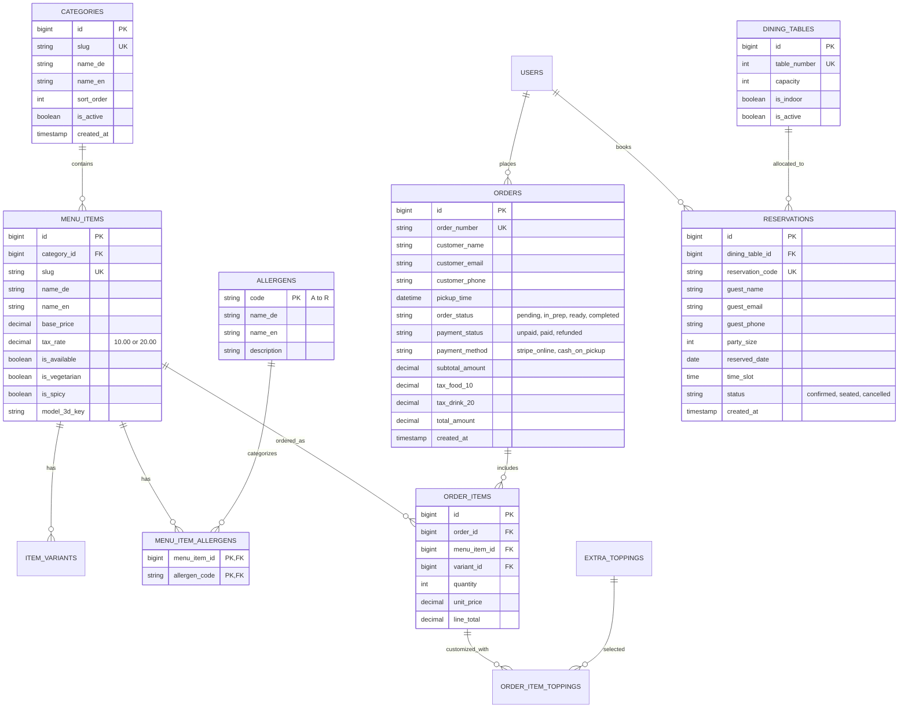

# Little Napoli: Entity Relationship Diagram & Data Model

This document outlines the relational data model for the Laravel backend and PostgreSQL database.

---

## 1. Mermaid Entity-Relationship Diagram

---

## 2. Table Indexing & Performance Strategies

1. **`menu_items`**: Composite index on `(category_id, is_available)` to serve menu requests in sub-5ms.
2. **`reservations`**: Composite index on `(reserved_date, time_slot, status)` to rapidly evaluate table capacity.
3. **`orders`**: Indexes on `(order_status, created_at)` and `(order_number)` for fast POS and kitchen dispatch queries.
